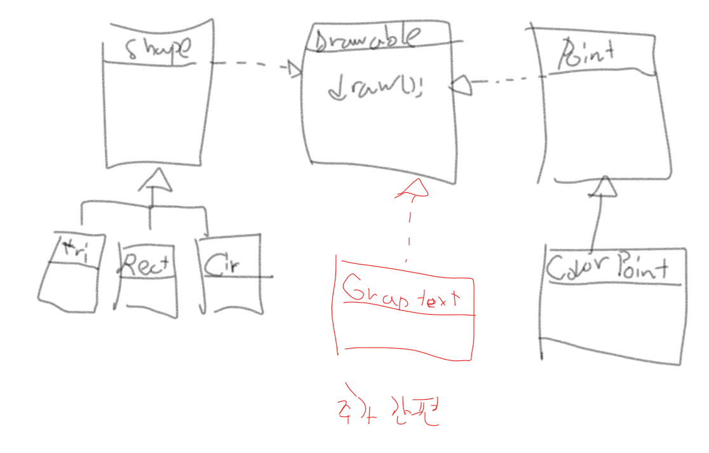
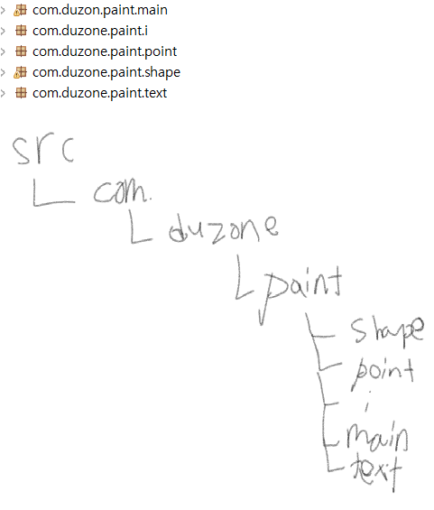

2019.01.02 공부내용정리
=========
상속 목적
--------
* 코드 재사용
* 확장성(OCP)

상속 특징
-------
* 다중 상속 지원X
* 다중 구현(Interface로 구현)
* 최상위 클래스 : java.lang.Object

method Overriding
---------------
Shape class (super Class)  
Triangle,
Rect,
Circle,

부모 클래스 Shape에서 draw 메소드를 구현하면 안됨

 
그렇다고 무조껀 추상을 사용해야 한다는건 아님.
 
Q.소프트웨어 커버리지가 어떻게되냐? 
-테스트케이스 돌려본 결과가 어떻냐? 80%이상 됨 등..

업캐스팅  -> 암시적 (Implicity)
-------
Triangle t2 = new Triangle(); 
	**Shape s = t2;** 
		s.draw(); 

다운캐스팅 -> 묵시적
--------
Shape triangle = new Triangle(); 
		triangle.setLineColor("black"); 
		//Triangle t1 = (Triangle)triangle; 
    **((Triangle)triangle).setX1(10)**; 
    draw(triangle);

상속과 생성자
-----------
실행순서
 
자식 생성자에 부모의 기본생성자가 무조껀 먼저 호출된다.

추상클래스
--------
객체들이 가지고 있는 속성과 기능 중에 중요한 것들은 남기고 필요 없는 불필요한 것은 없애는 것
    또는 객체들간의 공통되는 특성을 추출하는 것  
* 실체 클래스의 공통적인 특성들을 추출해서 선언한 클래스
* 실체 클래스를 만들기 위한 부모 클래스로만 사용되는 클래스( 객체를 직접 생성해서 사용할 수 없다)
* 하나 이상의 추상 메소드를 가진다.

추상 메소드
-----------------
* 구현이 불가능한 메소드
* 추상 클래스를 상속하는 실체 자식 클래스는 추상 메소드를 반드시 구현해야 한다.
* 추상 메소드는 추상 클래스에만 존재한다.

인터페이스
----------

Drawable circle3 = new Circle(); 
  draw(circle3);

  Drawable cp1= new ColorPoint(100,10,"blue"); 
  cp1.draw();

  GraphicString gs = new GraphicString("Hello"); 
  draw(gs);

  ColorPoint p3 = new ColorPoint(100,50,"red"); 
  draw(p3); 

  

  instanceof
  -------------------

		Shape s10 = new Circle();
		System.out.println(s10 instanceof Shape); //true
		System.out.println(s10 instanceof Circle); //true
		System.out.println(s10 instanceof Rect);  //false
		System.out.println(s instanceof Drawable); //true
		System.out.println(s instanceof Runnable); //false

		Circle c = (Circle)s10;

		System.out.println(s10 instanceof Circle); //true
		System.out.println(s10 instanceof Shape); //true
		System.out.println(s10 instanceof Object); //true
		// 에러: 계층 관계가 아닌 경우에는 연산을 할 수 없음
		//System.out.println(s10 instanceof Rect); //error

자바 패키지
---------

예외 (try - catch - finally)
------
1.로그남기기 
2.사과 
3.종료 
4.보통 큰회사는 예외처리 메뉴얼이 있고 그대로 따라하면 됨. 

